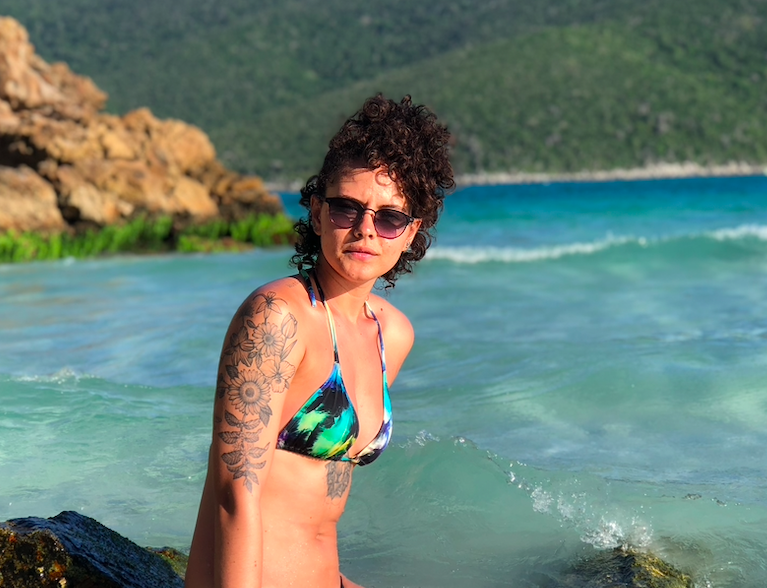
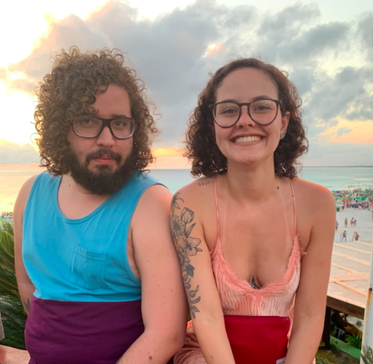
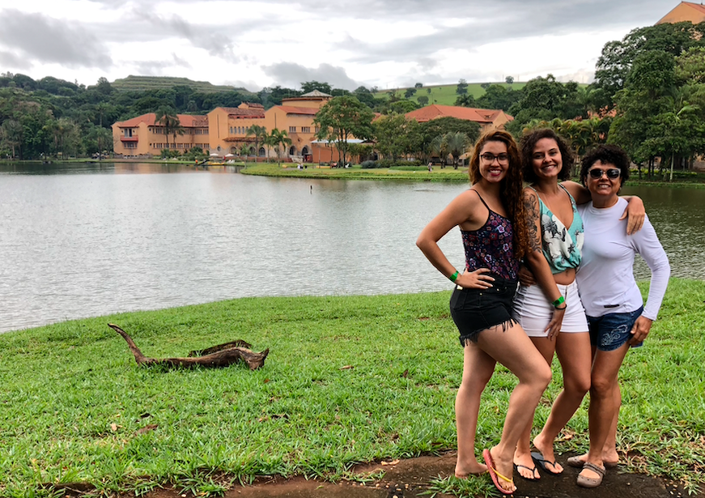

### De Petrópolis a Arraial: monumental e fenomenal

Em dezembro de 2018 eu deveria estar embarcando para o Perú e Colômbia, conhecer todos aqueles lugares mais lindos, quis o destino que eu cancelasse esta viagem e cumprisse uma promessa anterior: viajar com Linarum para essa região do Rio. 

Aproveitamos que nossos tios estavam indo e acabamos indo juntos. Passamos primeiro por Petrópolis, dessa vez exatamente na época do Natal, pudemos ver as apresentações nos museus; comemos umas comidas caras e meio nota 6,5. Leo e eu dormimos em um hostel e ele queria dormir na cama de bebê, rsrs. 

Depois seguimos para Arraial, realmente nós nos hospedamos em Arraial, mas ainda pudemos conhecer Búzios e Cabo Frio. Conhecemos as praias mais bonitas de Arraial, Pontal do Atalaia, Praia do Forno... todas incríveis demais o azul é tão azul. A água muda de cor dependendo de onde você está e pudemos fazer um passeio em um barco, foi tudo bem lindo, passamos em frente umas grutas e a água estava sempre maravilhosa. 

À noite estava sempre acontecendo uns shows na praia, Douglas e eu tivemos o privilégio de ver Detonautas tocando em Arraial do Cabo, foi simplesmente perfeito. Outros dias tocaram Ultraje a Rigor e aquela banda do "ouvi dizer que quando arrepeia já era". Foi bem maneiro, mas chega latejava a batata da perna de tanto ficar em pé!

Um dia fomos a Búzios, lá é lindo demais. Conhecemos algumas praias, a maioria estava simplesmente absurdamente lotada, não tinha nem onde sentar! Nós optamos por ficar na praia do Geribá que era a maior de todas e ainda encontramos um lugar para sentar e comer. Passamos pelas praias de Cabo Frio, mas acho que, verdadeiramente as de Arraial são as mais... charmosas!

Nós nos divertimos muito, entre as bricadeiras com os meninos e os passeios legais que fizemos. Até mesmo estruturamos o carolzinhas's make up, foi turuu. Passamos o ano novo na praia e foi quando eu decidi que queria sempre passar meus anos novos em alguma praia, não sei porquê, é o lugar que penso que devo estar. Tivemos show, contagem regressiva e fogos de artifício, pulamos 7 ondas e ficamos na praia por um tempão petiscando os queijos finos que a tia Vilma comprou hehe.

Na nossa volta, ficamos alguns dias em Araxá, um hotel bem chique, bem bonito que tem um espaço voltado para tratamentos, massagens, yoga, esse tipo de coisa relaxante, um SPA! Lá tem muito essa coisa da água milagrosa, talvez por isso seja um local tão holístico. O melhor de tudo, pra mim, era a comida, almoço, janta e café da manhã... tudo incluído e uma delicia! 

Também foi nesse hotel que tivemos a célebre cena do Douglas caindo da cama e dizendo "meu deus do céu, que que aconteceu" GRANDE MOMENTO. 

Voltamos pra casa com mais um pedacin desse brasilzão na memória.