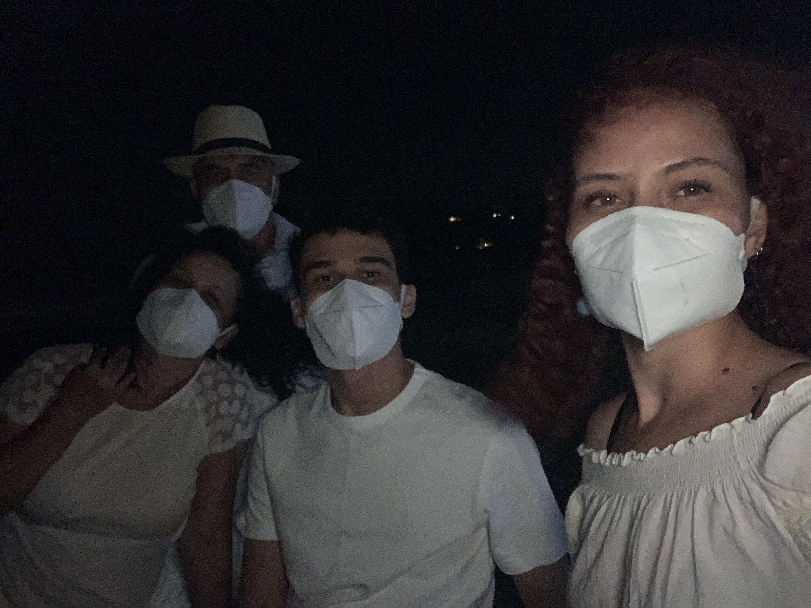

### Frio, deserto aglomerado e por-do-sol

A escolha de ir pra Pipa foi do Leo. Nunca vou esquecer. Chegamos à Pipa no meio do MAIOR FURDUNÇO, sério. Muita gente na rua, muita gente na praia, muito carro, muito som, muito tudo... menos máscara! Descobrimos que as praias de Pipa são todas acessadas pelo mesmo lugar (péssimo) e que a praia principal, na maré baixa, é cheia de pedra.

Sentamos na ponta da ponta da praia pra evitar a aglomeração de gente, pegar um vento e tal. No bar, tocava Marília Mendonça = tudo. A verdade é que não foi tudo que eu esperava, a praia é bonita, mas as que são mais frequentadas nem são tão bonitas, nem tão boas pra banho. E a comida, claro, super cara. A vista era bonita, dava para ver quase todas as praias do litoral de Tibau Sul. 

Por falar em Tibau Sul, foi lá que nos hospedamos, não em Pipa (ainda bem!). A melhor coisa foi finalmente estar numa casa, a pousada era bonitinha, mas cansativo demais estar perto de outras pessoas. Na Perolinha pudemos descansar, e a casa era A MAIOR GRACINHA DO MUNDO! Sério, eu tirei fotos pra roubar o projeto e fazer a minha. No mesmo dia que chegamos, ainda fomos ver o por-do-sol na Praia de Giz. Acho que foi o mais bonito que vi nessa viagem. 

A praia é linda, ótima pra banho, mais vazia e ainda é encontra com um rio. Ver os barcos e balsas no rio, fazendo a travessia, durante o por-do-sol foi lindo demais. Também é uma praia que tem um arrecife, o que gera uns bancos de areia quando a maré está baixa, dá pra ver o espetáculo do meio do mar!

No dia seguinte, fomos à praia do Madeiro... de volta ao sofrimento! Fomos cedo, o que foi ótimo. Pegamos a praia vazia, aproveitamos bem, almoçamos; mas a medida que ia ficando mais tarde, o calor ia aumentando e mais pessoas chegavam. Acho que somou tudo e no final estávamos todos passando mal de calor. Não é uma praia que venta muito, então... não ajudou! Sem dúvidas, ainda é melhor que Pipa, principalmente pra banhar!

Na noite de ano novo, apostamos na praia de Giz e estávamos certos! A praia estava DESERTA, fazia um tempo bom, mas ventava muito. Ficamos à beira-mar por algumas horas até a contagem regressiva, fogos, ondas, pedidos, agradecimentos e promessas... alguns minutos depois já estávamos voltando com os (semi)idosos no lombo, com dificuldade pra subir as ladeiras hehe

Acho que o ponto alto de Pipa, além do ano novo – que por si só já me trazia bons sentimentos, porque realmente tenho esperanças em um ano melhor –, foi a vista do mirante entre Pipa e Tibau Sul, absolutamente PERFEITA. A gente se sente muito pequeninha diante da imensão do mar, do espaço, na percepção do tempo que aquelas estruturas estão ali. E, ao mesmo tempo, é indescritível sentir que se faz parte disso tudo. 

No dia 01/01/2021 seguimos para João Pessoa, algumas baixas por vir, mas também dias de descanso necessários! E lá vem mais um post!