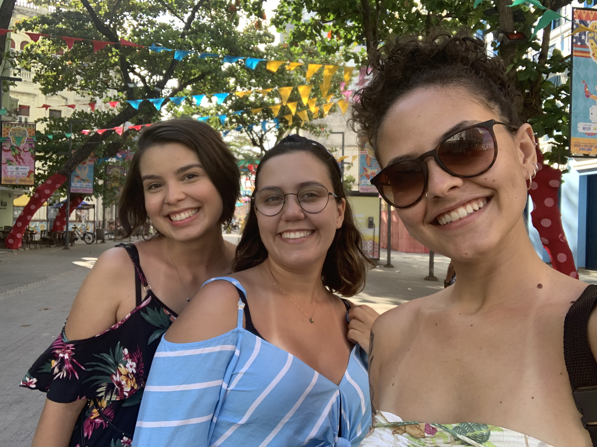
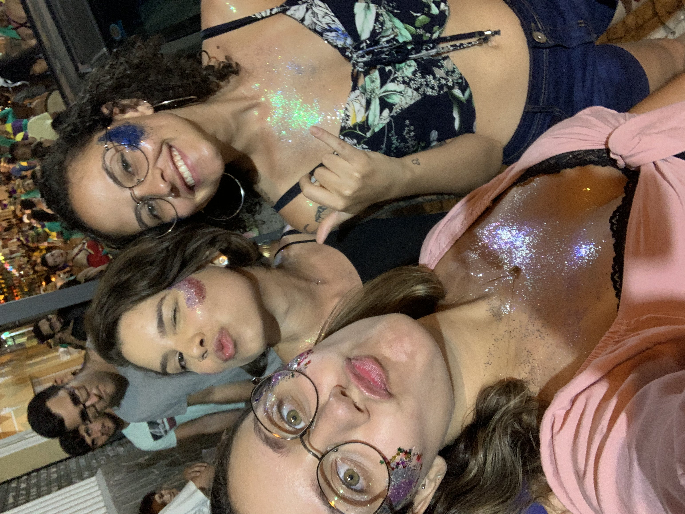

### La belle de jour!

Em março de 2019 a Mariana nos informou que estava de mudança para Maceió (sinceramente, sabe). Quando ela se mudou, Lulu e eu combinamos que iríamos visitá-la, até porque né... Maceió!

Em setembro, encontrei a passagem perfeita para o Recife e decidi que ia conhecer a região primeiro e depois seguiria para Maceió para encontrar a Mari. Foi aí que começou. De repente, BOOM, a gente já tava planejando uma super viagem das migs, passando pelos lugares mais lindos. 

Mari e eu fizemos uma surpresa para a Lulu, compramos a passagem dela e reservamos os hotéis, para que todas nós estivéssemos nesse lindo rolê. Nós passamos 15 dias perfeitos viajando, foi incrível. Chegamos no Recife no dia 13 de fevereiro de 2020, a Mari foi nos buscar no aeroporto para a gente começar nossa aventura!

Primeiro, passamos cinco dias no Recife, eu não conhecia nadica nessa região e foi tudo perfeito. Nos hospedamos num airbnb em Candeias, eu fiquei responsável pelo roteiro na cidade. Algumas coisas a gente não conseguiu fazer porque era época de carnaval, então tudo que não era carnaval estava fechado!

No primeiro dia, nós nos acomodamos e compramos as coisas que precisaríamos em casa e no dia seguinte já fomos para a linda praia de Boa Viagem. Como todas as praias do nordeste são perfeitas, essa aqui é muito singular, tem uma temperatura excelente, é azulzinha e tem um paredão (os arrecifes de corais) que tornam a beira da praia uma verdadeira piscina!

A gente também aproveitou pra conhecer a parte histórica da cidade, e estava tudo tão bonito! Duvido que tenha uma época mais bonita para conhecer o Recife, tudo decorado para o carnaval, fomos na casa de bonecos gigantes e no marco zero. À noite estava rolando um bloquinho ali pelo centro e a gente resolveu curtir o pré-carna de Recife!! É incrível, simplesmente todo mundo muuuito animado.

 No terceiro dia, nós resolvemos viver um pouco de carnaval em Olinda! A gente conheceu a parte histórica de Olinda, (aah detalhe, passamos pelo memorial do Chico Science!), visitamos uma igreja que tem a vista mais linda de Recife e Olinda juntas! Almoçamos num lugar muito quente, mas que a comida era bem boa e a vista linda! Do nada nos vimos perdidas em um bloco, então... TACA GLITTER! Comemos um acarajé perfeito, compramos um monte de quitutinhos lindos e voltamos pro airbnb. 

 

 No quarto dia, a gente pegou mais uma praiana e de tardinha pra noite mais carnaval! Vi o show da Luedji Luna e ela estava, como sempre, perfeita! Depois de nos perdermos um pouco, acarajé, segui bloco e comprar quitutes... voltamos pra casa, íamos nos arrumar pra seguir viagem no dia seguinte. Mas isso é história pra outro post!