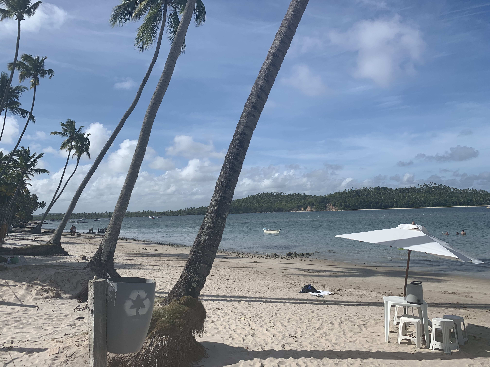

### Lanchas, casamentos e argilas

Todo mundo sempre diz que o melhor é o inesperado. Okay, depois de planejar cada pedacinho da nossa viagem, no dia 17 nós seguimos para Porto de Galinhas e no meio do caminho fizemos uma parada em Tamandaré - praia dos Carneiros. 

Chegando lá, nós resolvemos fazer um passeio de lancha ao redor da praia pegando o ponto de passar argila no corpo, os bancos de areia e as piscinas naturais. Foi bem aqui que essas garoutas me obrigaram a tentar tirar umas fotos de blogueira, claro que eu estraguei todas elas. 

A praia dos Carneiros é absolutamente linda, com os coqueiros na beirada, a água superazul e super deliciosa. No começo do passeio, a gente ficou um tempo com as mulheres que fazem argila, passamos no nosso corpo e ficamos bem belas e hidratadas. 

Mais um pouquinho de lancha... chegamos nos bancos de areia e é incrível porque eles parecem ser o último pedacinho de terra antes de entrar naquele marzão perfeito. A Mari tentou várias fotos de blogueira, jogando água pra cima... eu atrapalhei todas elas e ficou tudo mais divertido. A Lulu resolveu começar a juntar conchinhas pra trazer de volta. 

Depois seguimos para as piscinas naturais, nadamos com os peixinhos e tiramos várias fotoquinhas com a gopro perfeita da Mari. Demos aquela velha enrolada no moço da lancha já que né... pagamos muito por pouco tempo passeio (como sempre), mas a enrolada valeu a pena. 

Almoçamos um tremzin top, tiramos um belo de um sono, conhecemos a igreja onde a Mari vai se casar (incrível que esses trem fiquem em pé por tantos séculos). Mais algumas fotinhas e estávamos prontas para seguir viagem, mas isso é assunto pra outro post!