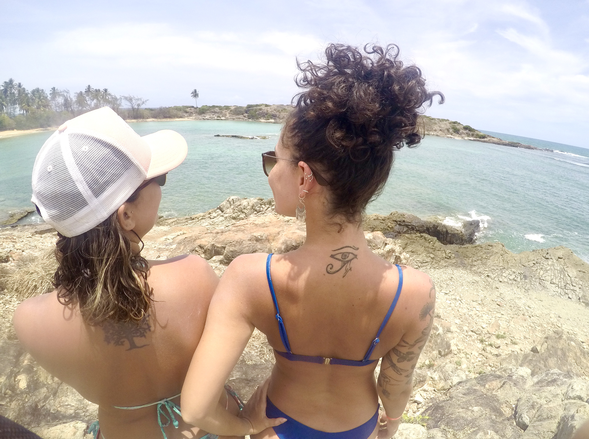

### Pousadas ruins, pré-carnaval e bonitezas 

Depois de Carneiros seguimos para Porto de Galinhas, nos hospedamos em uma pousada que reservamos de última hora e, depois de acomodadas, fomos dar um rolezinho pela cidadezinha. Óbvio que eu morri em absolutamente todas as feiras de artesanato, sério, eu queria comprar absolutamente tudo. Jantamos uma pizza bem top e voltamos logo pra pousada porque eu precisava fazer um trabalho (ódio).

Essa noite fo o horrível, não dormi nada, comecei a passar mal e os resultados disso não devem nem ser escritos aqui. Basta dizer: as pousadas PRECISAM tirar o cheiro de nhaca dos seus colchões!

No dia seguinte, fizemos um passeio de buggy ponta a ponta pelas praias de Porto de Galinhas e devo dizer: é o jeito mais legal de conhecê-las! O carinha do buggy era bem legal e nos deixava ficar o tempo que quiséssemos nos lugares, negociamos ficar mais tempo em um que em outros, e aproveitamos as diferentes praias galinhenses. 

Na hora do almoço, Lulu e eu comemos peixe pela primeira vez a viagem toda! Uma moqueca perfeita e simplesmente porque eu estava precisando depois de passar tão mal na noite anterior. Foi super fofo, a moça do restaurante fez um café só para mim porque eu estava morrendo de dor de cabeça (horrível até de lembrar). 

As praias são todas lindas, mas eu confesso que a melhor parte do passeio para mim foi a ida ao mangue. Era uma parte do passeio que eu não dava nada por ela, e nós fomos numa jangada mangue a dentro, banhamos no ponto onde o mar encontra o mangue bem na hora do por-do-sol e estava tudo perfeito. Nós vimos cavalos marinhos e zoamos uns franceses ridículos que estavam na jangada ao lado. 

À noite demos mais umas voltinhas pela cidade, conhecendo parte que ainda não tínhamos visto, em busca de alguns presentinhos. Em algum momento desse dia eu perdi minha tornezeleira da amizade e isso gerou um grande caos! Fomos na feirinha de artesanato, mas não conseguimos encontrar nenhuma que fosse boa o suficiente para substituir. 

No dia seguinte, nós fizemos um passeio até a ilha de Santo Aleixo e assim... taca-lhe história sabe. Começando pela Lulu nervosíssima com o barco (que ia enlouquecidamente brigando com o mar pra chegar na ilha). A gente aproveitou para tomar uns banhos tops, sentamos na primeira fileira de cadeiras e fomos enganadas com o almoço (de novo). Fizemos uma trilha até o outro lado da ilha, ouvindo histórias de tempos coloniais e blábláblá... 

A vista era tão bonita, o mar tão lindo que simplesmente nada mais importava (nem o povo chato que estava no passeio com a gente). Tiramos umas fotos naquelas pedras, mar, pedras, coqueiros, meninas bonitas... sacomé. 

Em um momento a gente resolveu que ia ser legal tirar foto na pedra bem no meio da baía... PÉSSIMA IDEIA. Depois de nadarmos até cansar pra chegar na pedra, ela era, obviamente, muito escorregadia! Resultado: guerreiras feridas. Não conseguimos nos segurar na pedra, tiramos uma foto podre (porém a melhor da viagem toda) e a Lulu pensou que ia ter que amputar o pé. Isso quase acabou com o dia, mas em dado momento a gente passou um remedinho, deu tudo certo.

Quando chegamos na pousada (já estávamos no nosso terceiro quarto nessa pousada horrível), todo mundo mais tranquila, jantinha, presentinhos, arrumação pra saída no dia seguinte... começou a zoeira com o drama da Luiza por conta do pé machucado. Meu pai do céu!!! Acho que Mariana e eu quase tivemos dor de barriga de tanto rir.

No dia 20, pela manhã, saímos no sentido de Japaratinga rumando para Maceió, mas a gente ainda tinha algumas paradas legais pra fazer!