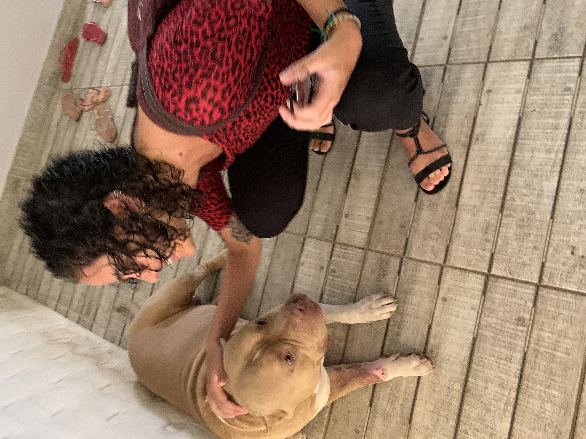
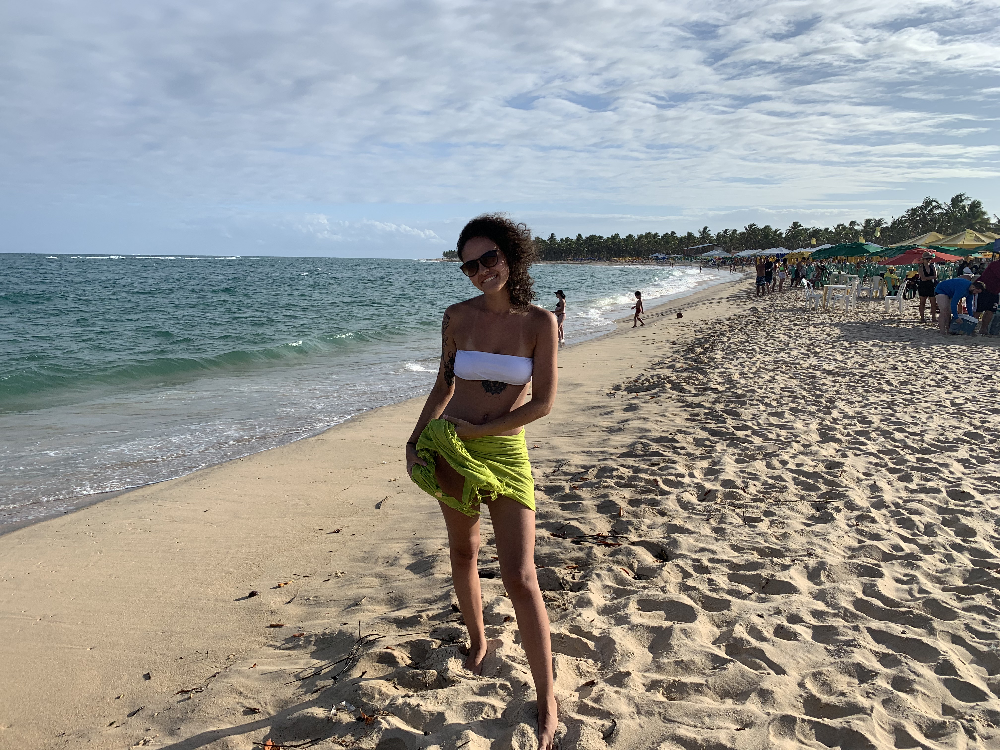
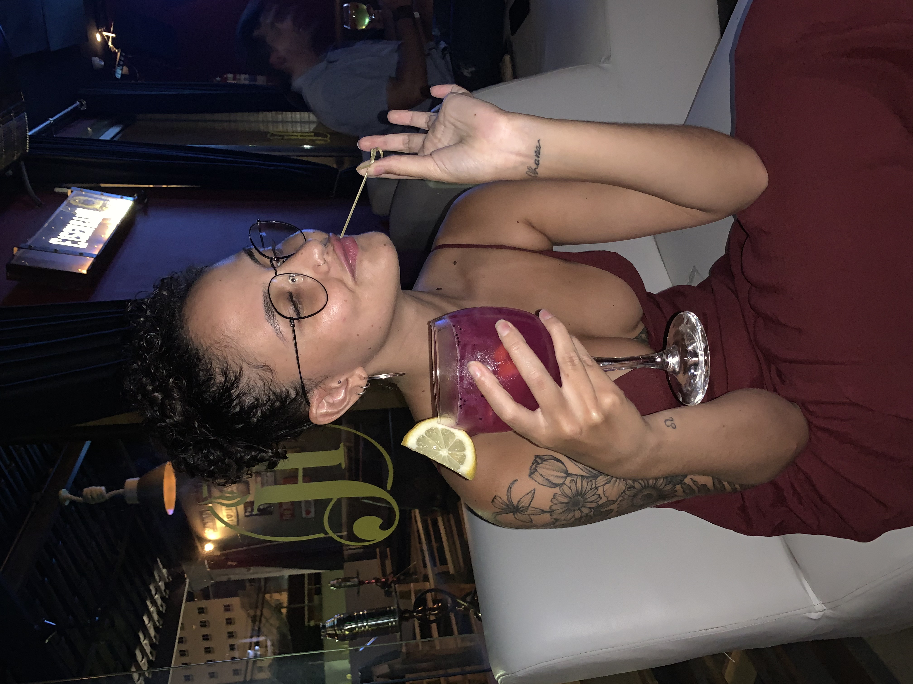

### A casa da Magui

Finalmente, depois de tantas aventuras, nós chegamos na casa da Magui!! Diga-se de passagem: que casa! Maceió, diferente dos lugares por onde tínhamos passado, não tem uma parte histórica tão chamativa e nem um carnaval tão intenso... e essa era justamente a semana do carnaval.

Em momentos diferentes da viagem, nós três adoecemos. Na casa da Magui, foi ela que ficou meio ruinzinha e a Lulu também teve um dia que tava mais ou menos. Aqui foi um momento em que nós curtimos a casa da Mari e fizemos coisas de... amigas que passam o dia inteiro na casa uma da outra. Eu precisei trabalhar em alguns momentos, mas foi tudo muito aconchegante. 

A Mari nos levou para conhecer os negócios que ela e o Max estão tocando na cidade, também conhecemos as praias mais da cidade mesmo, ali na Ponta Verde. A casa da Mari fica tipo na beira da praia, simplesmente. Bem ao lado da praia das Garças, nós fomos a essa praia algumas vezes, levamos o Thor (dog mais lindo), espantamos homens folgados e nos divertimos um bucadão. 

Um dia, nós fomos à praia do Gunga que é, na minha humilde opinião, a mais bonita de Maceió. Foi uma looonga viagem, muito trânsito e tal... mas estávamos embaladas ao som de dorimê. Fomos ao mirante da praia, e é inexplicável, não entendo quem teve a ideia de plantar aqueles coqueiros, mas caralho que lugar lindo. O mar é lindo e quando ele entra assim pras dunas... é perfeito parece que só existe areia e mar.

A gente ficou ali pela beira da praia, almoçamos uma enganação, quase arrumamos briga com gente folgada, mas aproveitamos muito cada minutinho até a maré começar a subir muito. Na volta, passamos na feirinha de artesanato, coisinha mais preciosa, mas não encontramos muita coisa interessante lá.

O estrago mesmo aconteceu no dia que fomos para as feirinhas de artesanato de Maceió. Encontramos uma tornozeleira para substituir a que eu tinha perdido, mas também, misericórdia, eu comprei simplesmente TUDO. Enchemos o saco do Max pra pedir a Mariana em casamento, chamamos ele de namoradinho, tomamos sorvete chiquinho e brigamos com uns homens podres. Mas, acima de tudo, curtimos a maresia perfeita do mar perfeito de Maceió. 

Comemos numa churrascaria (baratíssima) que a Mari ama e deixamos os abestados dos homens chocadíssimos com três mulheres que podiam PAGAR SUAS CONTAS e estar sozinhas na churrascaria! À noite, a gente foi conhecer o novo Hookah da Mari, comemos uns trem bom, bebemos umas bebidas boas. A Mari tava meia ruinzinha e nós fomos embora logo. 

E o melhor é que o tempo parece que passou 10x mais devagar, a gente conseguiu aproveitar cada segundinho. Foi uma viagem perfeita, com amigas perfeitas e ainda comemoramos antecipadamente o aniversário da Mari (foi uma surpresa)!

Lulu e eu fizemos tudo em segredo enquanto ela estava dormindo e, quando acordou, tinha um bolinho para ela com umas velinhas decoradas. Ela ficou muito emocionada, e a gente também, depois de dias com dificuldade para fazer um almoço; na casa da mari tinha TUDO que precisávamos pra fazer um bolo!!

No último dia, Lulu e eu entramos no avião com um aperto no coração, tinha sido tudo bom demais! A viagem que me rendeu 6 publicações nesse bloguinho... imagine quantas boas memórias e fotos eu vou guardar para sempre!